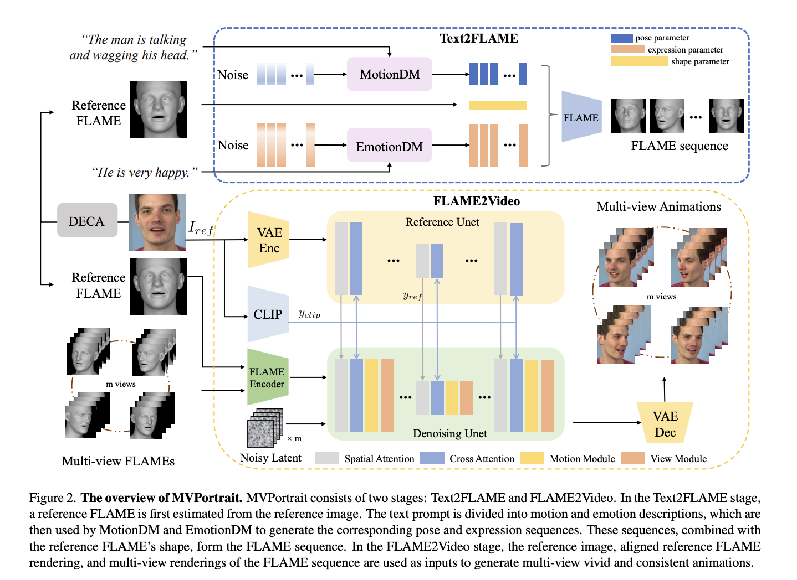
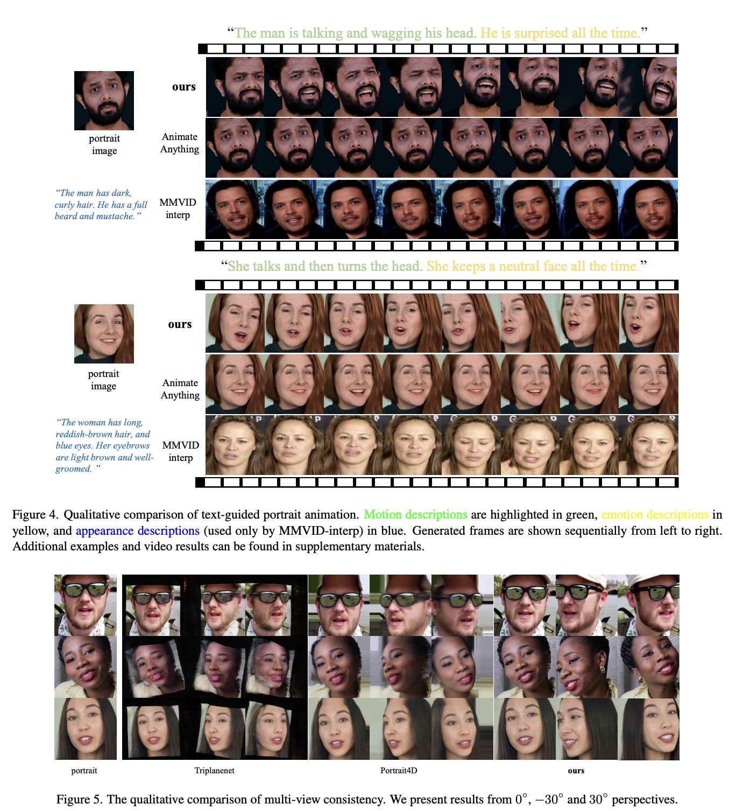
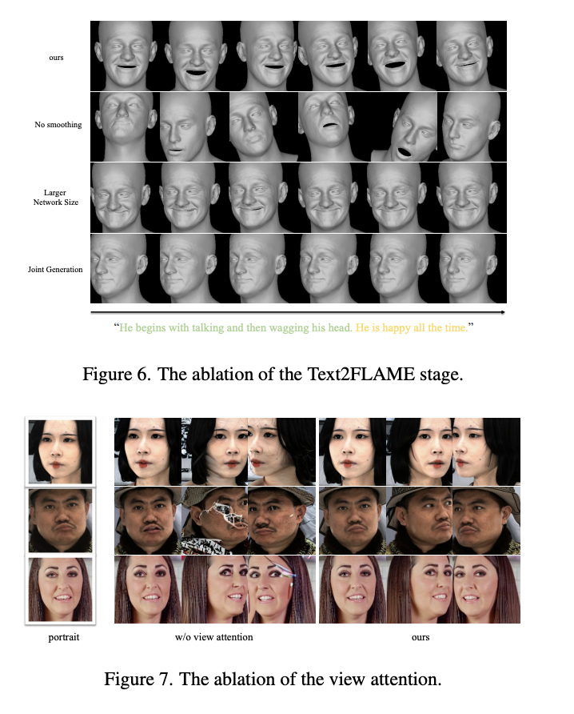

# MVPortrait: Text-Guided Motion and Emotion Control 
for Multi-view Vivid Portrait Animation

Yukang Lin*, Hokit Fung*, Jianjin Xu, Zeping Ren, Adela S.M. Lau, Guosheng Yin†, Xiu Li†

<a href='https://arxiv.org/abs/2403.17694'></a>

We introduce MVPortrait, a novel two-stage text-guided framework for creating expressive multi-view portrait animations that accurately capture motion and emotion.

## Pipeline


<table>
<tr>
<td><h2>Demos</h2>

</td>
<td><h2>Ablation Studies</h2>

</td>
</tr>
</table>

## Comparisons

### Text & Video-driven Comparison


<table>
<tr>
<td><h3>Audio-driven Comparison</h3>

</td>
<td><h3>Multi-View Comparison</h3>

</td>
</tr>
</table>

# Training
Coming soon~
# Inference

# Data

## Citation
If you find our work useful, please consider citing:
```
@article{lin2025mvportrait,
  title={Mvportrait: Text-guided motion and emotion control for multi-view vivid portrait animation},
  author={Lin, Yukang and Fung, Hokit and Xu, Jianjin and Ren, Zeping and Lau, Adela SM and Yin, Guosheng and Li, Xiu},
  journal={arXiv preprint arXiv:2503.19383},
  year={2025}
}
```
